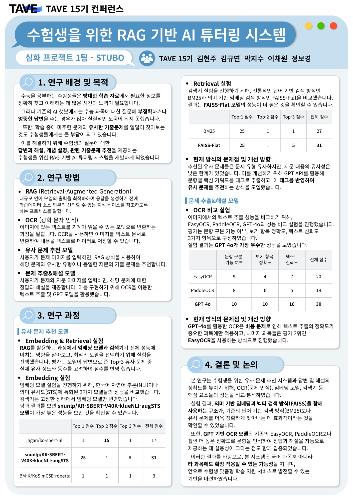

# 📚 STUBO : 수험생을 위한 RAG 기반 AI 튜터링 시스템

**이미지 기반 수능 국어 문제 자동 분석 및 튜터링 서비스**

>**STUBO**는 수능 국어의 문학, 비문학, 화법과 작문, 언어와 매체 영역에서 지문 및 문제 이미지를 업로드하면,   
>**OCR → 문제 이해 → 정답 및 해설 생성 → 유사 문제 추천**까지 자동으로 수행하는 AI 기반 튜터링 시스템입니다.

---

## 📌 프로젝트 개요

- **주제:** RAG 기반 국어 문제 풀이 및 유사 기출 문제 추천 시스템 개발
- **목표:**  
  - 국어 지문 및 문제 이미지 기반 자동 분석 및 설명 제공
  - 질문에 대해 정답 및 해설, 유사 기출 문제, 출처 정보까지 통합 제공
  - 과목별로 최적화된 파이프라인을 구축하여 성능 비교 및 통합 운영
  - Streamlit 기반 직관적인 웹 UI 제공

---

## 🙌 STUBO 팀원 소개

| 이름 | 역할 |
|------|------|
| 김현주 | 팀장 / 문학 파이프라인 담당 |
| 김규연 | 비문학 파이프라인 담당 |
| 이채원 | 화법과 작문 파이프라인 담당 |
| 박지수 | 언어와 매체 담당 |
| 정보경 | 언어와 매체 담당 |

---

## 🔍 핵심 기능

### 1. 📚 과목별 맞춤 파이프라인 제공
- `문학` / `비문학` / `화법과 작문`/`언어와 매체` 중 과목 선택
- 각 과목에 최적화된 파이프라인 모듈 실행  
  - **문학**: GPT-4o 기반 지문/문제 이미지 OCR → RAG 기반 정답/해설 생성 → GPT 기반 태깅 → FAISS 기반 유사 문제 추천
  - **비문학**: EasyOCR 기반 지문/문제 이미지 OCR → GPT-4o 기반 문제 해결 및 해설 생성 → GPT 기반 태깅 → Sentence-BERT 임베딩 기반 유사도 계산 및 추천 
  - **화법과 작문**: EasyOCR로 지문/문제 이미지 OCR → GPT-4o 기반 정답 및 해설 생성 → FAISS 기반 임베딩 유사도 검색으로 유사 문제 추천
  - **언어와 매체**: EasyOCR로 지문/문제 이미지 OCR → GPT-4o 기반 정답 및 해설 생성 → GPT 기반 태깅 -> (FAISS/Sentence-BERT 모두 시도) 기반 임베딩 유사도 검색으로 유사 문제 추천

### 2. 🖼️ 이미지 기반 문제 분석 (OCR)
- 지문/문제 이미지 업로드 시 OCR을 통해 원문 그대로 텍스트 추출
- 문단 구조/특수기호/강조 표시까지 복원
  - **문학**: GPT-4o로 지문 이미지 5등분 → 정밀 OCR + 강조/기호/범위 복원
  - **비문학**: EasyOCR로 지문과 문제를 추출하고, 선택지 숫자(①~⑤)를 자동 인식하여 구조화된 문제 텍스트 복원
  - **화법과 작문**: EasyOCR로 지문/문제 텍스트를 추출하고 GPT-4o로 보완 분석하며, 시각 정보까지 활용하여 정답과 해설을 생성
  - **언어와 매체**: EasyOCR로 지문과 문제를 추출하고, 선택지 숫자(①~⑤)를 자동 인식하여 구조화된 문제 텍스트 복원

### 3. 🧠 정답 및 해설 생성
- LLM 기반 문제 분석 및 고품질 해설 생성
  - 과목별 문제 유형에 따라 최적화된 분석 구조 적용 (LLM 프롬프트 기반)
  - **문학**: RAG 방식으로 유사 기출을 참고해 지문 및 <보기>를 바탕으로 정답 도출 및 선택지별 해설 생성
  - **비문학**: 문제 조건을 반영한 정답 선택 + 오답 선택지에 대한 근거 포함한 해설 자동 생성
  - **화법과 작문**: 텍스트와 함께 지문 및 문제에 포함된 시각 정보를 GPT-4o Vision이 통합적으로 분석하여 정답과 선택지별 해설을 생성
  - **언어와 매체**: 문제 조건을 반영한 정답 선택, GPT 4o가 정답, 해설 생성

### 4. 🔁 유사 문제 추천 
- **문학**: GPT 기반 문제 태깅(장르, 작가, 제목, 유형 등) + 벡터 유사도 + 태그 유사도 결합하여 추천
- **비문학**: GPT 기반 지문 태깅 + 임베딩 유사도 계산으로 유사 기출 추천
- **화법과 작문**: OCR 기반 텍스트를 FAISS로 검색하여 유사한 문제 반환 + 해당 기출의 정답/해설도 함께 제공
- **언어와 매체**: GPT 기반 문제 태깅(언어 키워드 5개, 매체 키워드 5개(키워드 3개, 접근방식 2개)) + 임베딩 유사도 계산(사용자 문제 질문, train data 내 지문)으로 유사 기출 추천

### 5. 🌐 사용자 친화적 UI (Streamlit)
- 이미지 업로드, 과목 선택, 유사 문제 수 (1~5개) 조절 등 직관적인 인터페이스
- 정답, 해설, 유사 문제 결과를 단계별로 시각적으로 확인 가능

---

## 📂 프로젝트 구조

(※ 용량 제한으로 인해 github에는 2022학년도 3월 모의고사의 기출문제 이미지만 포함되어 있습니다)
<pre>
수능 국어 AI 튜터링 시스템/
├── Streamlit_App.ipynb              # 메인 Streamlit 인터페이스

├── 문학/
│   ├── pipeline_literature.py       # 문학 전용 파이프라인
│   ├── data/
│   │   ├── output_images/           # 문학 유사 기출문제 이미지
│   │   ├── literature_only.txt      # 문학 원본 문제 텍스트
│   │   └── literature_tagged.json   # 문학 태깅 완료 JSON
│   ├── faiss_index_답변해설/        # 문학 정답/해설용 벡터 인덱스
│   └── faiss_index_유사문제/        # 문학 유사문제 추천용 벡터 인덱스

├── 비문학/
│   ├── pipeline_non_literature.py   # 비문학 전용 파이프라인
│   └── data/
│       ├── img/                     # 비문학 유사 기출문제 이미지
│       └── non-literature_cleaned.json  # 비문학 전처리된 문제 데이터

├── 화작/
│   ├── pipeline_speechcomp.py       # 화법과 작문 전용 파이프라인
│   ├── data/
│   │   ├── output_images/           # 화작 유사 기출문제 이미지
│   │   └── 최종 json/               # 최종 화작 문제 데이터
│   └── outputs/                     # 화작 유사문제 추천용 벡터 인덱스

├── 언매/
│   ├── pipeline_langmedia.py       # 언어와 매체 전용 파이프라인
│   ├── data/
│   │   ├── output_images/           # 언매 유사 기출문제 이미지
│   │   └── save_json_tagged/        # 최종 언매 문제 데이터
  
└── README.md                        # 프로젝트 설명서
</pre>

---

## 🌟 기대 효과

- 수험생이 **혼자서도 문제를 깊이 있게 학습 가능** 
- 단순 정답 제공을 넘어, **논리적 근거 기반 해설 제공**
- 문제 유형 분석 + 유사 기출 문제까지 연계해 **효율적인 문제 풀이 학습 구조 확보**

---

## 📊 모델 성능 실험 결과

  

---

## 🛠️ 기술 스택

| 구성 요소                | 사용 기술 / 프레임워크               |
| -------------------- | --------------------------- |
| **이미지 OCR**          | GPT-4o (Vision), EasyOCR    |
| **LLM 기반 처리**        | OpenAI GPT-4o, GPT-4o-mini  |
| **검색 및 유사도 분석**      | SentenceTransformers, FAISS |
| **문서 기반 질의응답 (RAG)** | LangChain (RetrievalQA)     |
| **웹 인터페이스**          | Streamlit                   |
| **개발 언어**            | Python 3.10 이상              |

---

## 🖼️ 사용 예시

1. **지문/문제 이미지 업로드**
   - 국어 문제 스캔 이미지 선택
  
2. **과목 선택 (문학/비문학/화법과 작문/언어와 매체)**
  
3. **자동 분석 결과 확인**
   - 업로드한 지문/문제 이미지
   - 정답 및 해설
   - 유사 기출 문제 추천 (지문/문제 이미지 포함)
---

## 🔮 향후 발전 방향

- 영어, 수학 등 타 수능 과목으로 확장
- 사용자 로그 기반 개인 맞춤형 학습 추천 기능 강화
- GPT-4o 기반 멀티모달 튜터링 개선 및 학습 이력 관리 기능 추가
- OCR이 불완전할 경우 재업로우 요청 메시지 출력 기능 추가
- 모바일 인터페이스 최적화

---
